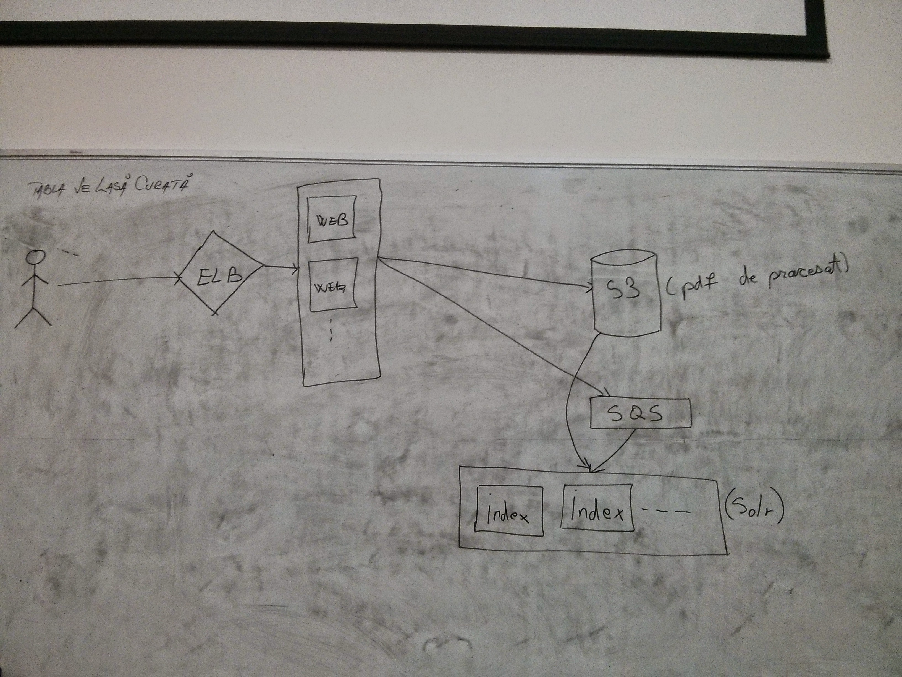
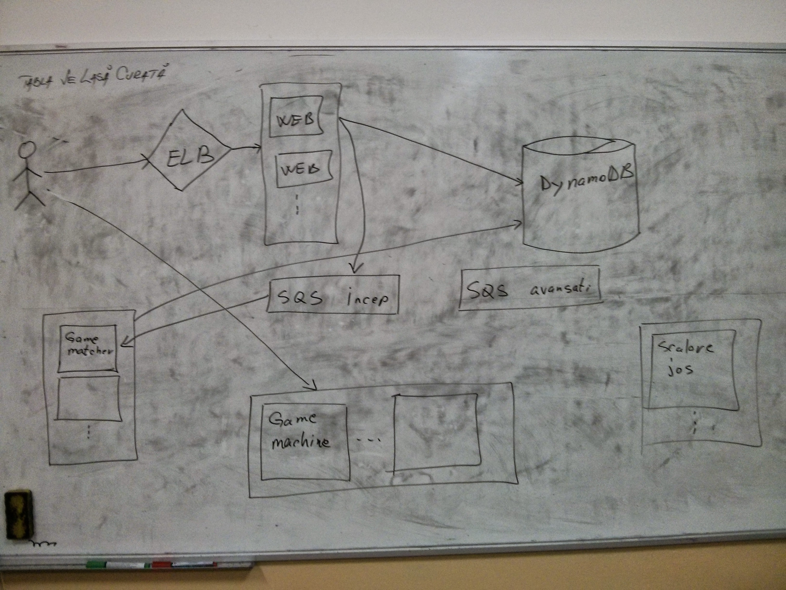
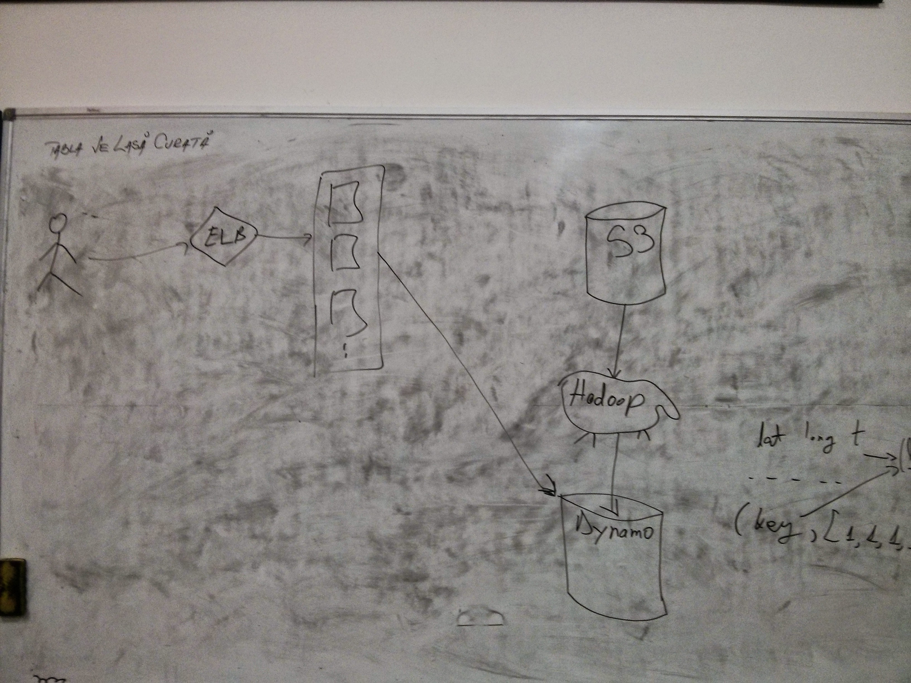

# Exemple de sisteme scalabile

## Motor de cautare in documente PDF

Vrem sa construim un sistem scalabil care este capabil sa indexeze o cantitate mare de documente PDF si sa caute text in aceste documente.

## Joc multiplayer online

Vrem sa construim un sistem scalabil care grupeaza jucatorii in functie de nivelul fiecaruia si simuleaza jocul real time.

## Analizator de coordonate geografice

Vrem sa construim un sistem scalabil care proceseaza coordonate geografice ( latitudie, longintudine, si un moment de timp ) si construieste o harta care afiseaza in functie de timp zonele cele mai active.

## Sistem de live streaming

Vrem sa construim un sistem scalabil care permite unui utilizator sa transmita video live de la webcam. Alti utilizatori pot viziona aceste streamuri.

