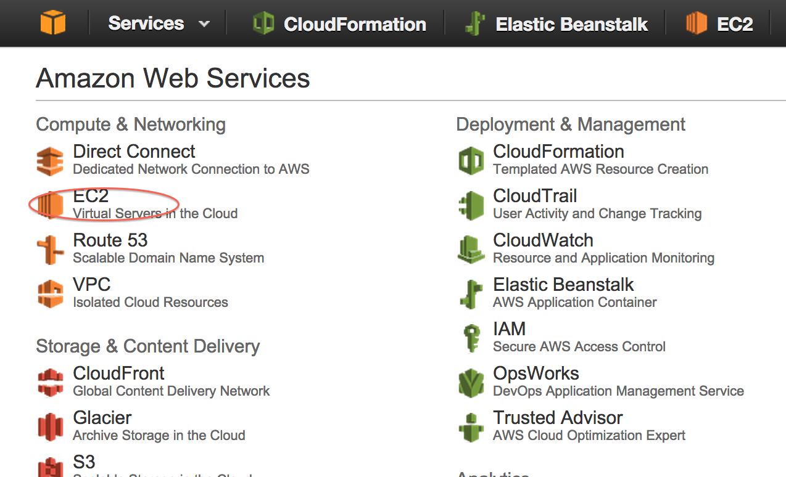
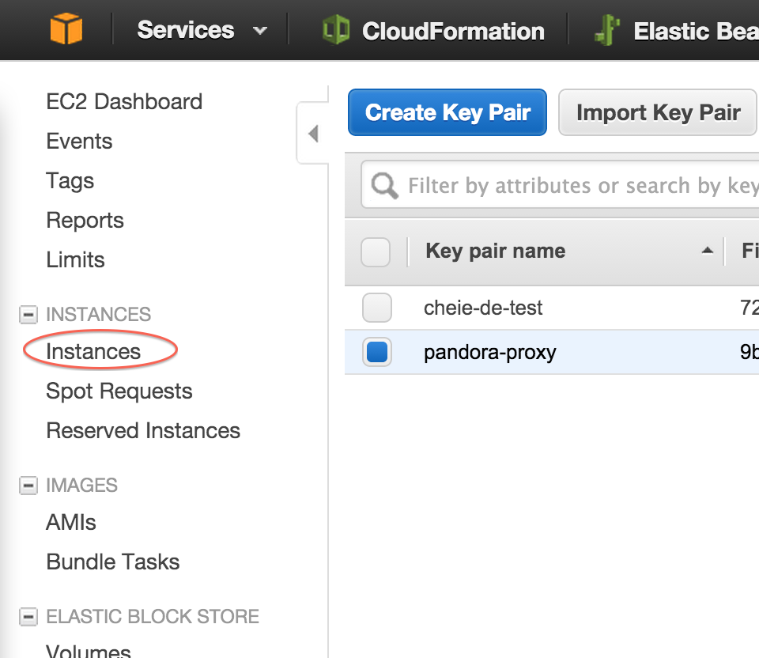
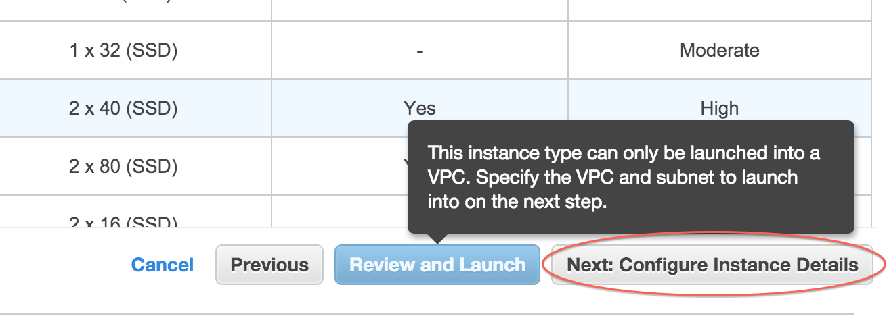
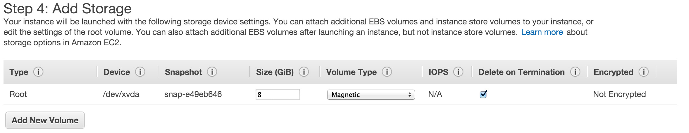
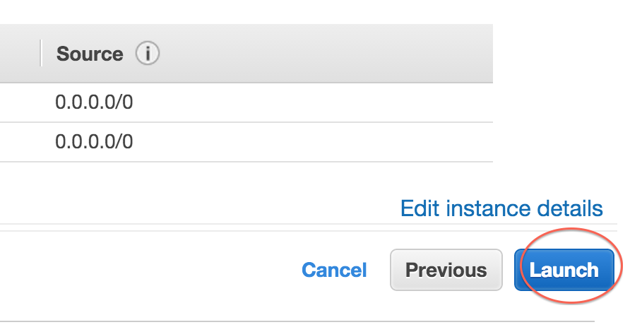
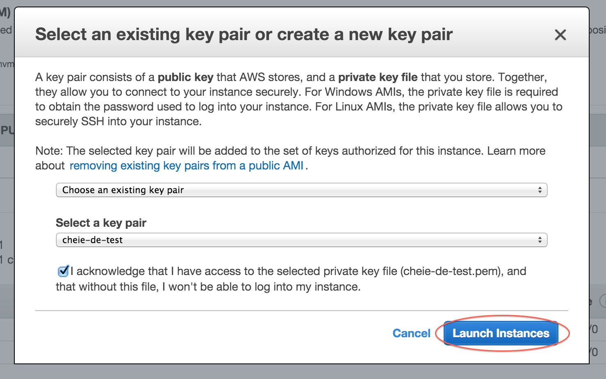
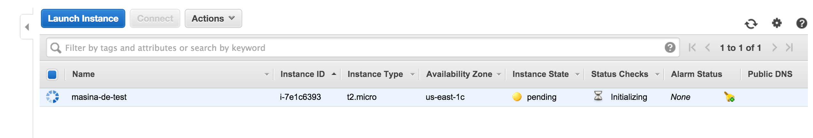
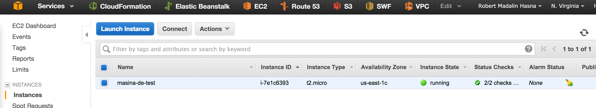
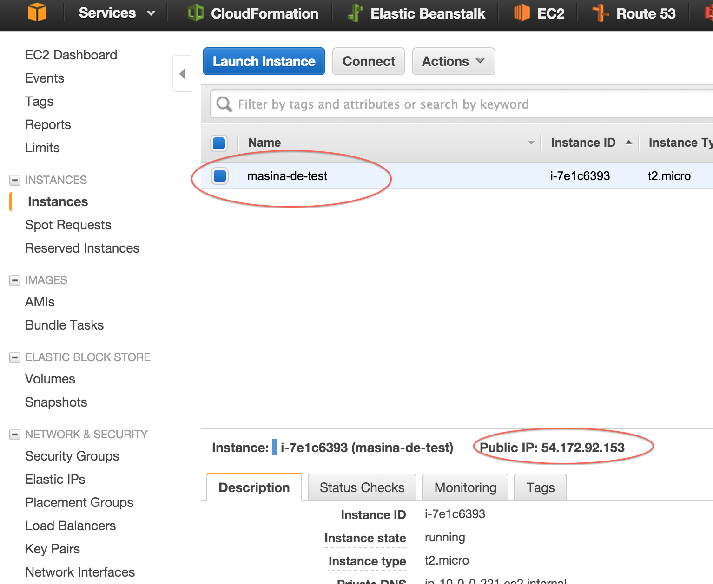

# Introducere in BASH - Bourne Again SHell

## Starea curenta

Promptul iti ofera niste informatii. In general arata cam asa: `user@host directorul/in/care/ma/aflu > `. Poti identificata utilizatorul cu care esti logat, masina pe care se executa comanda ( vom folosi remote, deci e bine sa stiti pe care masina lucrati ) si directorul curent.

## Comenzi utile

### Lucrul cu fisere

* Afisare calea directorului curent: `pwd`
* Listarea fisierelor din directorul curent: `ls`, `ls -la`
* Schimbarea directorului curent: `cd cale/catre/director/now`. Calea poate fi absoluta sau relativa.
* Setarea directorului parinte ca cel curent: `cd ..`
* Executarea unui binar din directorul curent: `./nume-fisier-executabil`
* Executarea unui binar care se aflta in path: `python`
* Executarea unui binar ca administrator: `sudo ./nume-fisier-executabil`
* Afisarea continutului unui fisier: `cat cale/catre/fisier`
* Afisarea paginata a unui fisier: `less cale/catre/fisier`
* Copierea unui fisier: `cp fisier/original cale/catre/copie`. Adaugati -r pentru directore. Inlocuiti `cp` cu `mv` pentru a muta fisiere.
* Editarea unui fisier: `vim cale/catre/fisier`. Vim e destul de complicat la prima vedere. Cheat sheet: <http://bullium.com/support/vim.html>

### Lucrul cu arhive

* Dezarhivarea unui zip: `unzip cale/catre/fisier.zip`
* Dezarhivarea unui tar: `tar -C cale/unde/sa/salvam/continutului --extract --file cale/catre/fisier.tar`

### Util pentru internet

* Download-area unui fisier de pe internet: `wget http://site.com/url/fisier.txt`. Va salva in directorul curent fisierul `fisier.txt`
* Apelarea unui API: `curl -X HTTP_METHOD --data "Mesaj de trimis" http://site.com/api/endpoint`. Exemplu `curl -X GET http://ipecho.net/plain`. Se pot si descarca fisiere cu el.
* Browser in terminal: `lynx`. Da este posibili :p

### Lucrul cu masini remote

 Conectarea prin ssh la o masina remote: `ssh -i cale/catre/fisier/identitate.pem user@host`. Exemplu `ssh -i ~/.ssh/id_rsa amaterasu@192.168.0.104`
* Copierea unui fisier de pe masina locala pe una remote: `scp -i identitate.pem cale/fisier/locl user@host-remote:cale/unde/sa/salvam/fisierul`. Adaugati `-r` pentru a trasfera directoare intregi.
* Copierea unui fisier de pe masina remote pe cea locala: `scp -i identitate.pem user@host-remote:cale/catre/ce/copiem cale/unde/sa/salvam/local`.

## Bash ca limbaj de programare

Se pot scrie programe intregi in bash. Toate scripturile de bootstrap din linux sunt scrise in bash. Are instructiuni conditionale, cicluri, variabile functii etc. Mai multe detalii [aici](http://linuxconfig.org/bash-scripting-tutorial).

# Amazon Web Services: EC2

## Logarea in sistem

1. Intr-un browser mergeti la `https://curs-aws.signin.aws.amazon.com/console` si logati-va.

## Crearea unei chei de ssh

1. Mergeti in sectiunea pentru EC2. 
1. Selectati  `Key Pairs`. 
1. Creati o cheie noua. 
1. Alegeti un nume unic. 

## Crearea unei masini remote EC2

1. Mergeti la sectiunea `Instances`. 
1. Deschideti formularul. 
1. Alegeti imaginea de baza de la care sa plecati. 
1. Selectati tipul masini pe care vreti sa o porniti. ALEGETI MICRO! 
1. Incepeti configurarea masini. 
1. Alegeti sa vi se dea un IP public. 
1. Alegeti device-ul de stocarea al masinii. 
1. Alegeti un nume unic pentru masina. 
1. Deblocati portul 80 din firewall. 
1. Lansati masina. 
1. Alegeti cheia de ssh pe care ati creat-o la pasul anterior. 
1. Veti gasi masina voastra in lista. Inca se initializeaza. Dureaza maxim 5 minute. 
1. Masina dupa ce s-a initializat. 

## Conectarea la noua masina

1. Selectati masina voastra din lista si aflati adresa ei publica ip. 
1. Deschideti un terminal si conectati-va la masina remote. Veti folosi cheia pe care ati creat-o la si ati folosit-o cand ati creat masina. Cand ati creat-o, browser-ul a downloadat-o.
1. Schimbati permisiunile pentru cheie: `chmod 500 ~/Downloads/cheie-de-test.pem`, altfel `ssh` nu va folosi cheia pentru ca spune ca nu este un mod securizat.
1. Deschideti conexiunea ssh catre masina: `ssh -i ~/Downloads/cheie-de-test.pem ec2-user@54.172.62.210`.

## Instalarea unui server http

In consola dupa ce v-ati logat pe masina remote prin ssh:

1. Instalati serverul apache2: `sudo yum install -y httpd`
2. Porniti serverul nou instalat: `sudo service httpd start`
3. Acum daca introduceti adresa ip intr-un browser, se va incarca pagina default a serverului apache.
4. Creati un visier `index.html` in dorectorul `/var/www/html`. Recomand sa folositi `vim` pentru a va obisnui cu el, fiind foarte util cand lucrezi prin ssh. O varianta mai rapida de crea fisierul cu continut este: `sudo bash -c "echo test de apache > /var/www/html/index.html"`

## Stergerea resurselor
1. Pentru a sterge o masina EC2, dati click dreapta pe ea din lista si selectati `terminate`. Asta va distruge datele de pe masina si va elibera resursele. Daca ii dati `stop`, sa va opri si aveti posibilitatea de a o reporni.
2. Stergeti si cheia de ssh pe care ati creat-o.
