# Amazon ELB: Elastic Load Balancer

## Crearea unui ELB

1. Mergeti la sectiunea pentru ELB: 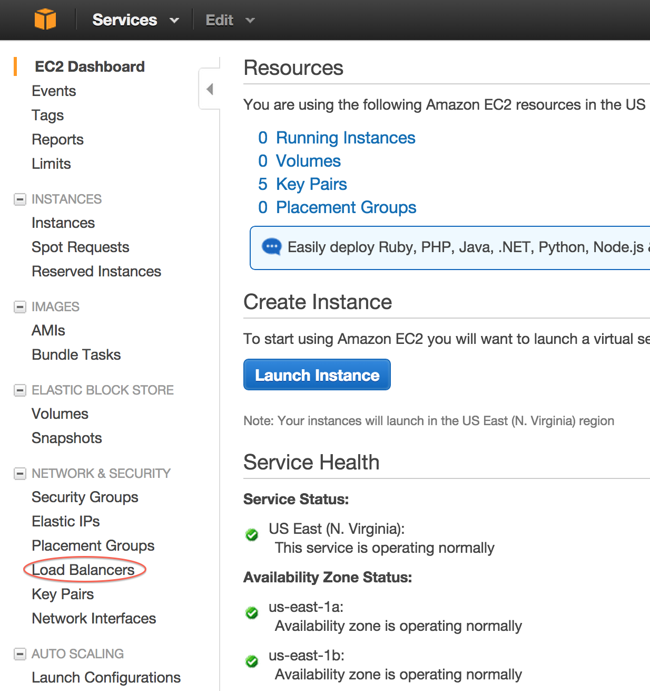
1. Incepeti procesul de creare: 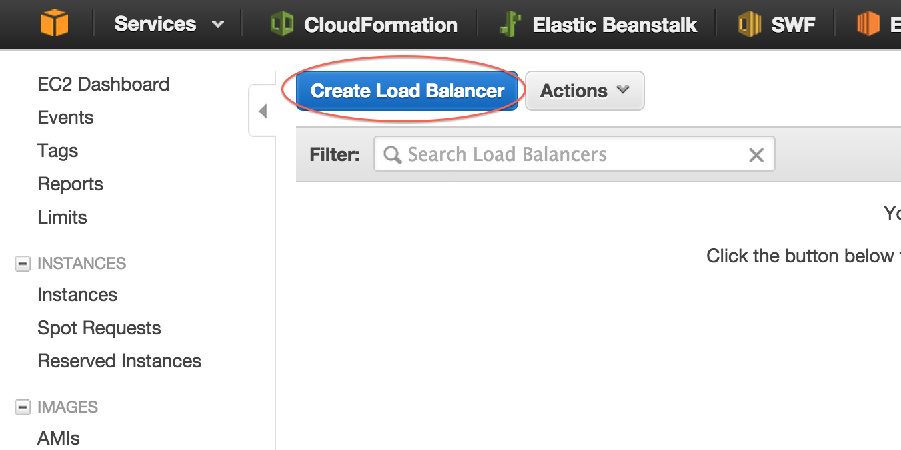
1. Setati numele lui, protocolul si portul de intrare si iesire. Conexiunile care vin in ELB la nivel de TCP pe portul 80 vor fi trimise catre o masina tot pe portul 80: 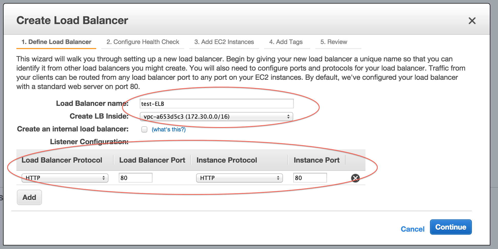
1. Configurati cum decide ELB-ul daca o masina mai poate servi cereri. Asa cum este in exemplu face cereri HTTP si cere fisierul index.html: 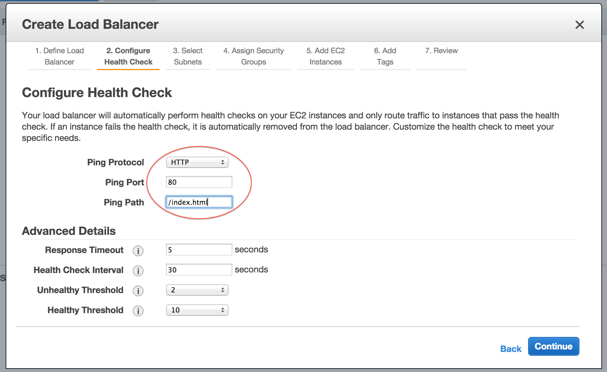
1. Adaugati toate subnet-urile la ELB. Vom ajunge sa studiem si ce fac subneturile in unul din cursurile urmatoare: 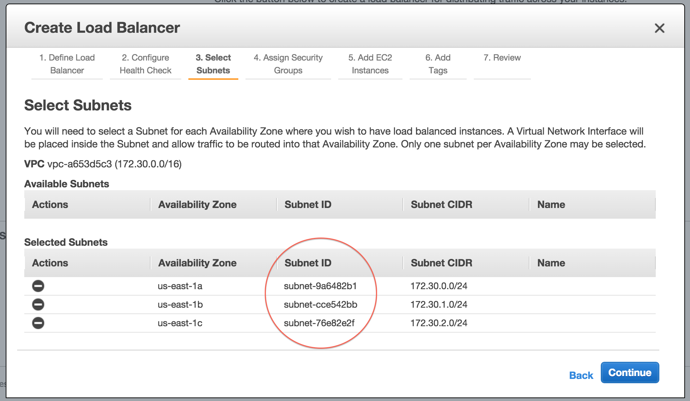
1. Selectati sau creati un Security Group pentru ELB. Putem de exemplu sa configuram ELB-ul astfel incat sa raspunda doar pentru un set de IP-uri: 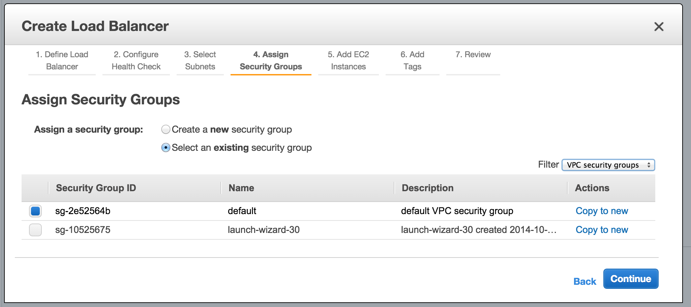
1. Puteti adauga de aici masini catre care sa trimita ELB-ul cererile. Se pot adauga si mai tarziu: 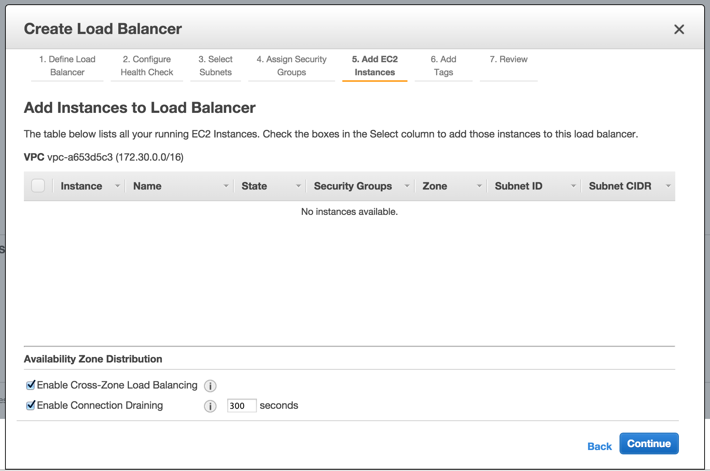
1. Puteti seta Tag-uri: 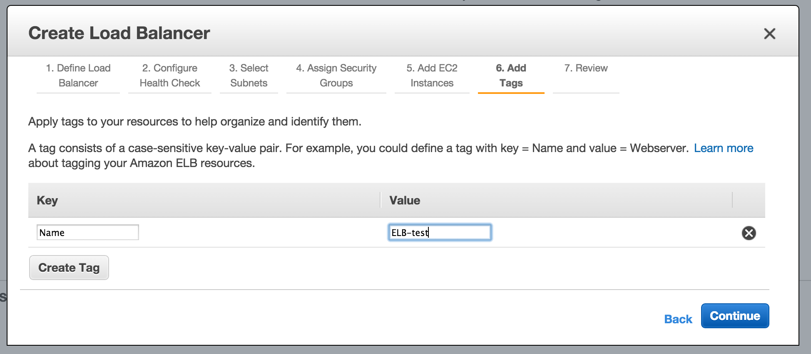
1. Terminati crearea ELB-ului: 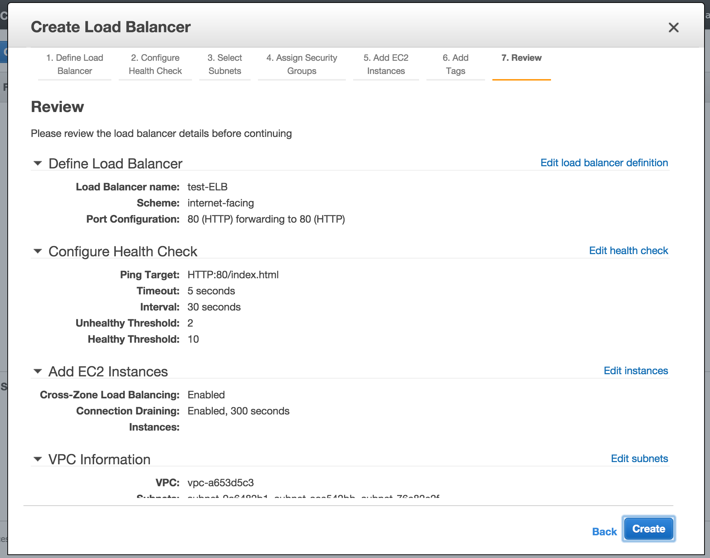

## Adaugarea unor masini catre care sa trimita ELB-ul cererile

Creati 2 masini EC2 si instalati un server HTTP pe fiecare. Faceti cele 2 masini sa raspunda cu mesaje diferite cand se cere fisierul index.html ( "Masina 1", "Masina 2" ) . Aveti grija sa creati masinile in VPC, nu EC2 clasic.

Editati setarile ELB-ului nou creat si adaugati masinile pe care tocmai le-ati creat in ELB:

1. Editati instantele asociate cu ELB-ul: 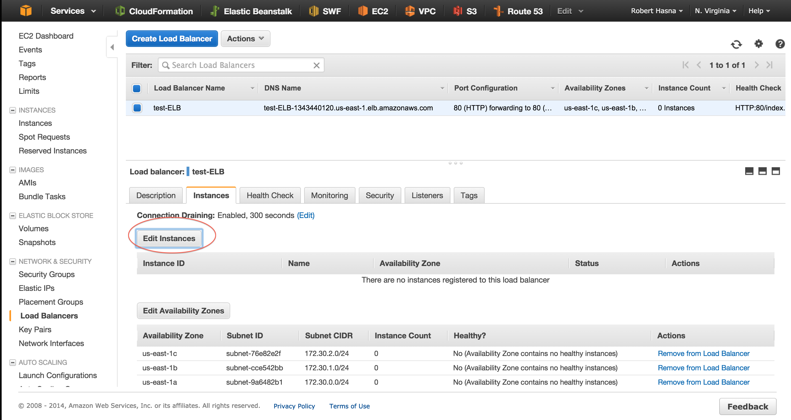
1. Adaugati cele 2 masini pe care ruleaza server-ul HTTP: 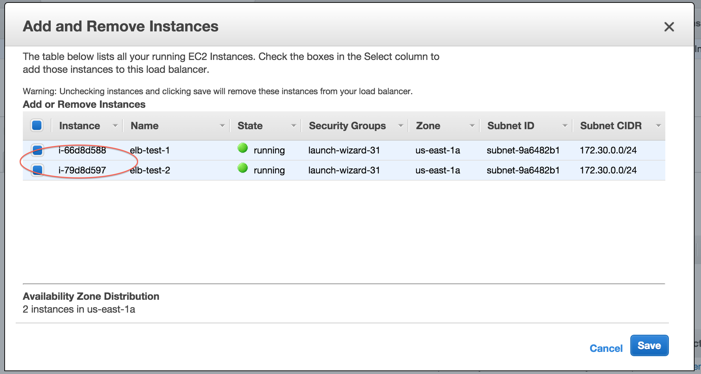
1. Masinile au fost adaugate dar ELB-ul nu trimite inca cereri catre ele. Trebuie sa se indeplineasca conditiile de healthcheck pe care le-ati setat cand ati creat ELB-ul: 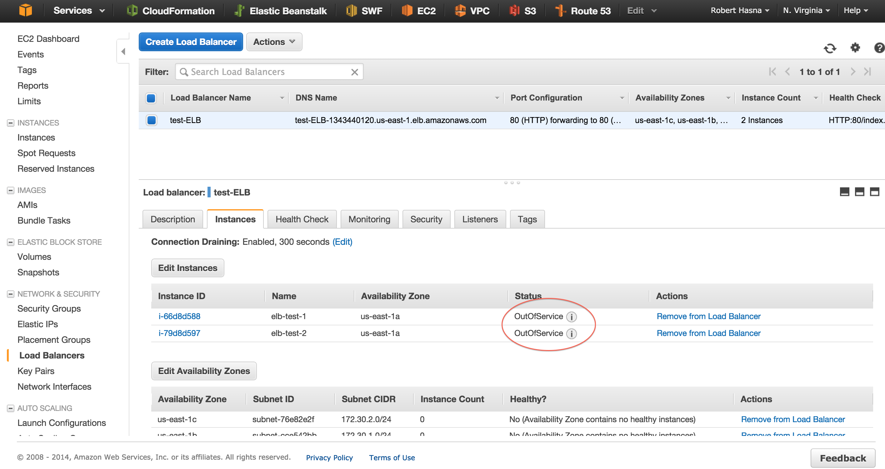
1. Cand conditiile sunt indeplinite, ELB-ul va trimite cererile catre masini: 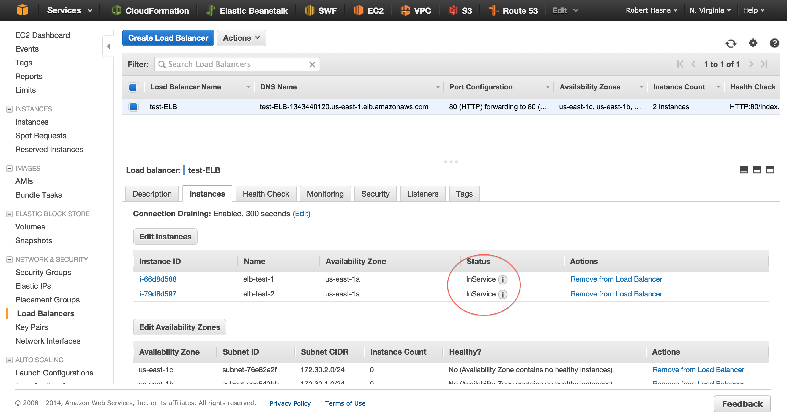

Deschideti un browser si introduceti adresa A Record a ELB-ului ( o gasiti la description ). Dati refresh de cateva ori si observati cum raspunsul variaza intre cereri. Cele doua mesaje pe care le-am scris in index.html pe fiecare server apar alternativ ( "Masina 1", "Masina 2" ).

# Amazon S3

## Crearea unui bucket

1. Din sectiunea pentru S3, creati un bucket in regiunea "US Standard": 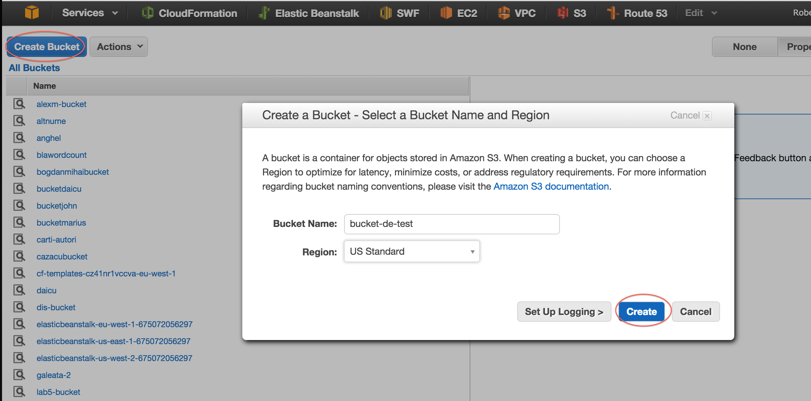
1. Bucket-ul a fost creat si este gol: 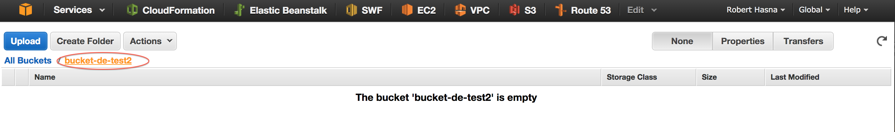

## Adaugarea, stergerea, citirea unui obiect/fisier

Interfata este foarte intuitiva. Adaugati, cititi si stergeti un fisier. Creati si un folder ( prefix ).

## Adaugarea, cititrea si stergerea unui obiect programatic

### Proiect exemplu

Clonati repository-ul curent pe masina locala.

In folder-ul `curs-aws/laborator/laborator3/s3` aveti un exemplu care scrie, citeste si sterge un fisier din S3.

### Rularea proiectului exemplu

Inlocuiti in cod cheile de acces si numele bucket-ului, impachetati proiectul ( maven ) si rulati jar-ul.

# Exercitiu: Server web care citeste din S3

Folosind exemplul de [aici](http://www.mkyong.com/maven/how-to-create-a-web-application-project-with-maven/) si cel din laborator, creati un server web care citeste continutul unor fisiere din S3 si il afiseaza ca raspuns.

Cand se acceseaza `http://IP.SER.VE.R/fisier1`, sa se citeasca fisierul `bucket-ul-meu/fisier1`. 
