# DynamoDB

## Crearea unui tabel

1. Mergeti la sectiunea pentru DynamoDB.
1. Incepeti procesul de creare: 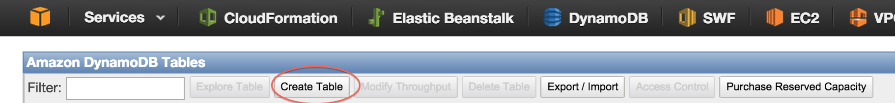
1. Configurati tipul de index: 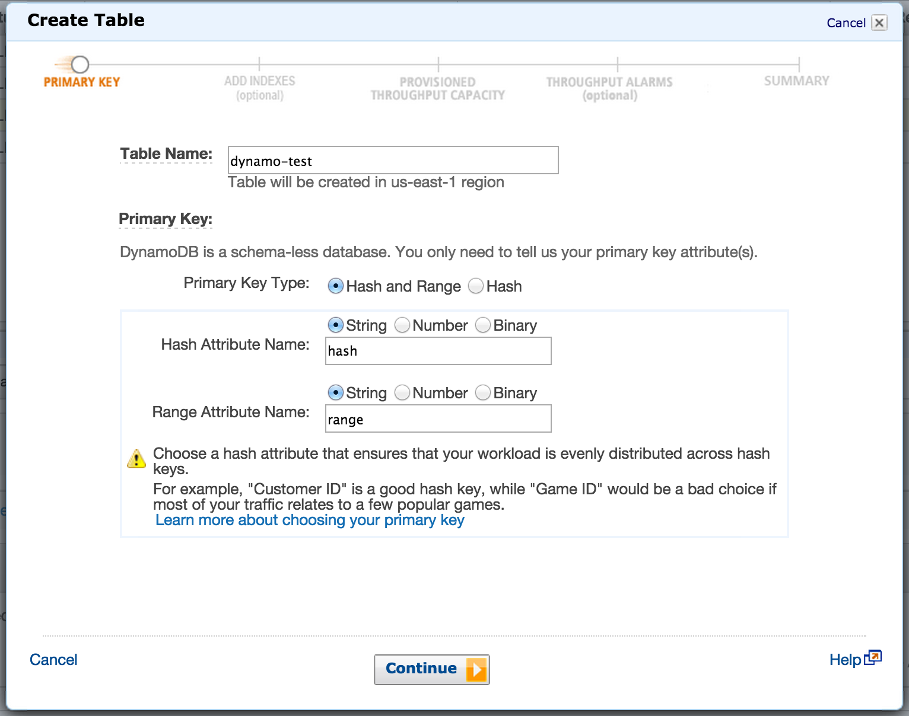
1. Puteti configura indecsi secundari: 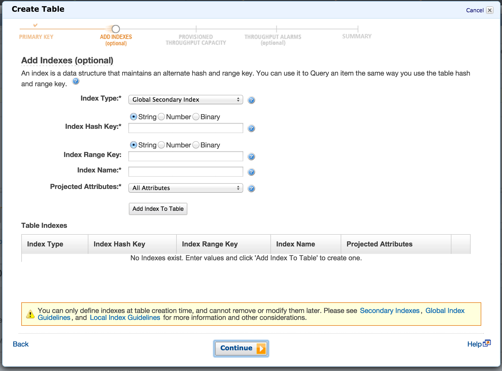
1. Configurati troughput-ul pe care sa il suporte tabelul. Citirea si scrierea configureaza separat: 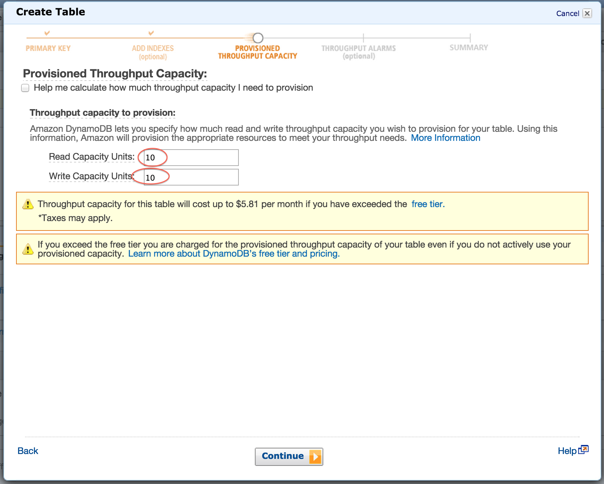
1. Puteti configura alarme: 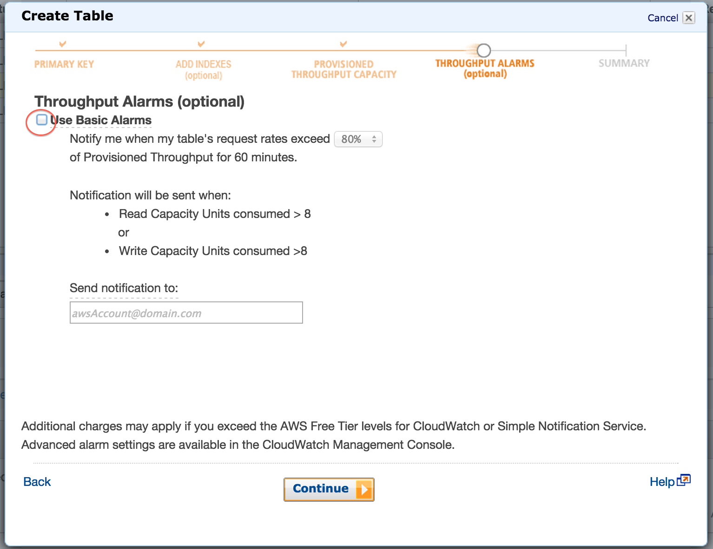
1. Sumar cu datele despre tabelul care se va crea: 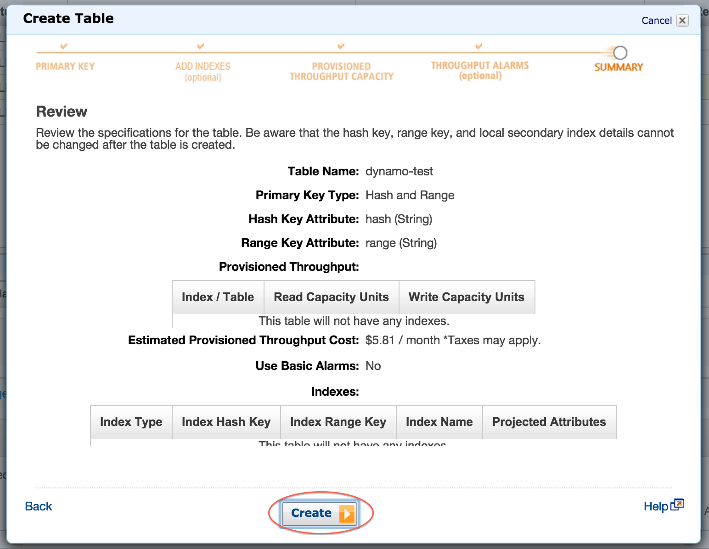
1. Tabelul a fost creat si este disponibil: 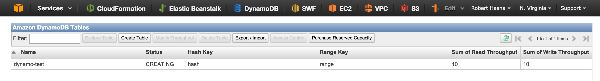

## Inserarea, interogarea si stergerea datelor prin consola web

### Inserare

1. Dati dublic click pe tabelul nou creat, sau selectati-l si click pe `Explore Table`.
1. Porniti procesul de inserare: 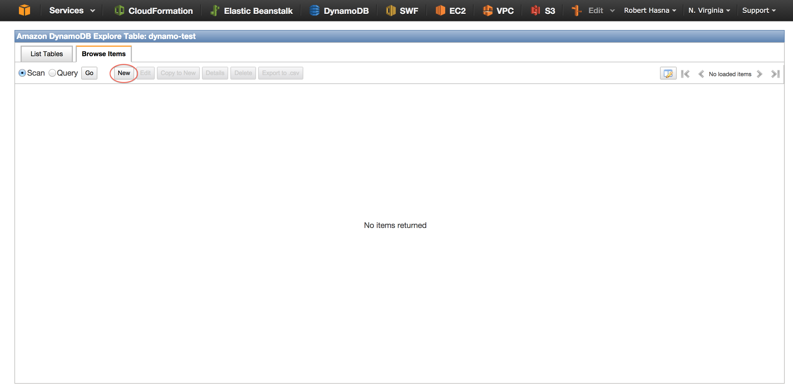
1. Completati datele despre noua intrare. HashKey si RangeKey sunt obligatorii. Puteti adauga si alte campuri ( coloane ) pentru noua intrare: 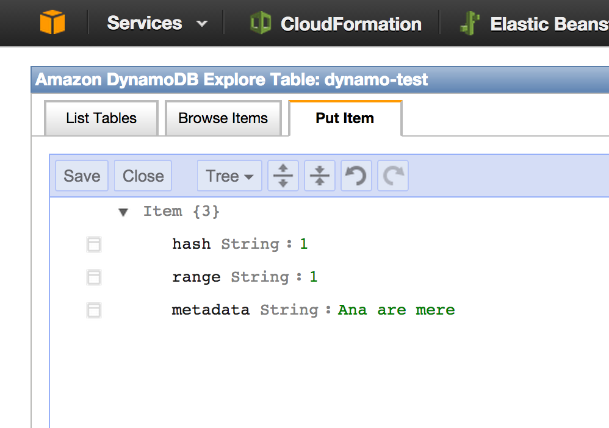
1. Salvati noua intrare: 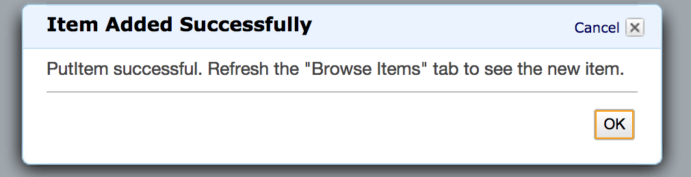

### Scanarea, interogarea

1. Inserati mai multe valori in tabel.
1. Selectati `Scan` si apasati `Go` pentru a afisa toate datele din tabela. Incercati si `Query` si extrageti doar anumite date din tabel. 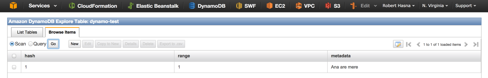

### Stergerea

Pentru a sterge o intrare din tabel, selectati-o si apasati butonul de delete :D.

## Inserarea, interogarea si stergerea datelor programatic

In directorul `laborator/laborator4/dynamo-db` aveti un exemplu care insereaza un item intr-un tabel si citeste intrarea pe care tocmai a inserat-o. 

1. Extindeti exemplul sa citeasca mai multe intrari print-un singur apel. 
2. Stergeti un mesaj.
3. Extrageti toate mesajele care au acelasi `hash`.

Gasiti un exemplu mai detaliat la [http://docs.aws.amazon.com/amazondynamodb/latest/developerguide/LowLevelJavaItemCRUD.html](http://docs.aws.amazon.com/amazondynamodb/latest/developerguide/LowLevelJavaItemCRUD.html)

# RDS

## Crearea unei baze de date MySQL

Mergeti la sectiunea pentru RDS si creati o baza de date MySQL. Urmariti pasii din procesul de creare. Aveti grija ca baza de date sa fie publica pentru a putea sa va conectati la ea.

Identificati adresa server-ului pe care l-ati creat.

Conectati-va la ea folosind utilitarul `mysql` din linia de comanda: `mysql --host=<adresa-server> --user=<user-admin> --password=<parola-setata> <nume-baza-de-date>`.

Acum promptul accepta comenzi uzuale de mysql `CREATE TABLE`, `SELECT` etc. Creati un tabel cu cel putin 2 coloane si inserati niste date in el.

Gasiti un tutorial la [https://www.digitalocean.com/community/tutorials/a-basic-mysql-tutorial](https://www.digitalocean.com/community/tutorials/a-basic-mysql-tutorial)

## Exercitiu

Comunicati programatic cu baza de date creata prin RDS.
Porniti de la unul dintre exemple. Veti avea nevoie sa editati fisierul de configurare maven `pom.xml` sa adaugati o noua dependinta pentru `connector-j` pentru ca JDBC sa poate comunica cu un server MySQL.

Gasiti exemple la [http://zetcode.com/db/mysqljava/](http://zetcode.com/db/mysqljava/)